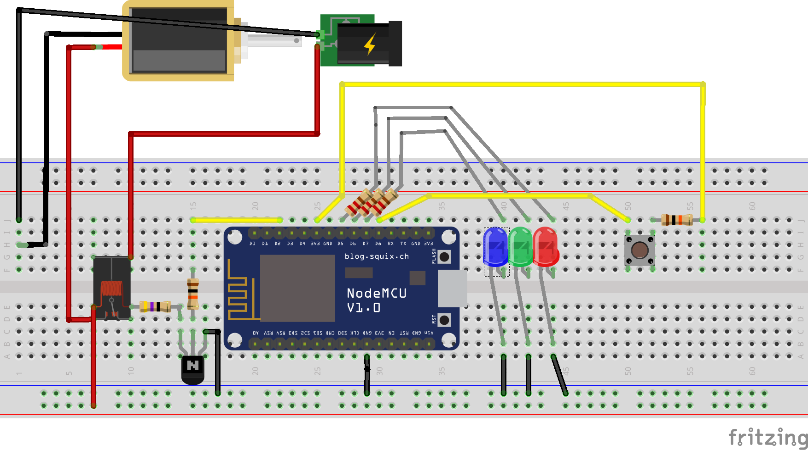

# Porteiro eletrônico comandado por chatbot

#### Emily Francine, Pedro Caetano, Rafaela Rossi e Rogério Grossi

---
# Motivação
* Abrir remotamente porta do CAF
* Controlar remotamente portas é útil para espaços públicos

---
# Segurança
* Provavelmente não é uma boa ideia conectar a porta da sua casa na internet
* Tipicamente pelo baixo poder computacional é difícil utilizar criptografia

---
# Hardware utilizado

---
# Código
Disponível em https://github.com/prcaetano/Porteiro-Rob-